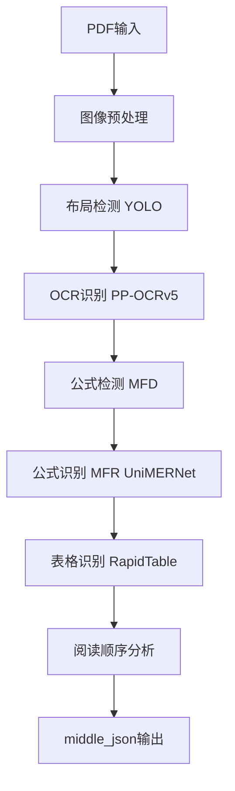

[根目录](../../../CLAUDE.md) > [mineru](../../) > [backend](../) > **pipeline**

# MinerU Pipeline 模块详细实现分析

## 变更记录 (Changelog)
- 2025-11-17 17:10:09 - 深度技术实现分析：性能优化、批处理、内存管理
- 2025-11-17 16:36:36 - 初始化Backend模块文档

## 模块职责

Pipeline模块采用传统流水线架构，通过多个专业模型的串联处理实现文档解析。这种设计保证了处理速度和稳定性，特别适合大批量文档处理场景。

## 核心架构设计

### 处理流水线架构


### 性能优化核心机制

#### 1. 智能批处理系统
```python
# 动态批大小计算
min_batch_inference_size = int(os.environ.get('MINERU_MIN_BATCH_INFERENCE_SIZE', 384))

# GPU内存自适应批处理
if gpu_memory >= 16:
    batch_ratio = 16
elif gpu_memory >= 12:
    batch_ratio = 8
elif gpu_memory >= 8:
    batch_ratio = 4
elif gpu_memory >= 6:
    batch_ratio = 2
else:
    batch_ratio = 1
```

#### 2. 模型单例模式
```python
class ModelSingleton:
    _instance = None
    _models = {}

    def get_model(self, lang, formula_enable, table_enable):
        key = (lang, formula_enable, table_enable)
        if key not in self._models:
            self._models[key] = custom_model_init(...)
        return self._models[key]
```

#### 3. 内存管理策略
```python
# 显存阈值控制
clean_vram(self.model.device, vram_threshold=8)

# GPU内存自适应
gpu_memory = int(os.getenv('MINERU_VIRTUAL_VRAM_SIZE', round(vram)))
```

## 详细实现分析

### 1. 核心处理流程 (`pipeline_analyze.py`)

#### 文档分析主函数
```python
def doc_analyze(pdf_bytes_list, lang_list, parse_method='auto',
                formula_enable=True, table_enable=True):
    """
    Pipeline文档解析核心函数

    性能优化特性:
    - 动态批大小: MINERU_MIN_BATCH_INFERENCE_SIZE
    - GPU内存自适应: 根据VRAM调整batch_ratio
    - 页面级批处理: 最小化内存占用
    """

    # 步骤1: PDF类型自动分类
    for pdf_idx, pdf_bytes in enumerate(pdf_bytes_list):
        if parse_method == 'auto':
            if classify(pdf_bytes) == 'ocr':
                _ocr_enable = True

    # 步骤2: 图像预处理和批处理组织
    images_with_extra_info = [(img, ocr_enable, lang) for info in all_pages_info]
    batch_size = min_batch_inference_size * batch_ratio

    # 步骤3: 批量处理执行
    for batch_image in batch_images:
        batch_results = batch_image_analyze(batch_image, formula_enable, table_enable)
```

#### 设备适配优化
```python
# NPU设备特殊优化
if str(device).startswith('npu'):
    import torch_npu
    torch_npu.npu.set_compile_mode(jit_compile=False)

# OCR批处理优化
if version.parse(torch.__version__) >= version.parse("2.8.0") or str(device).startswith('mps'):
    enable_ocr_det_batch = False  # MPS和新版PyTorch禁用OCR批处理
```

### 2. 批处理引擎 (`batch_analyze.py`)

#### 高精度模型配置
```python
# 批处理基础大小常量
YOLO_LAYOUT_BASE_BATCH_SIZE = 1      # YOLO布局检测
MFD_BASE_BATCH_SIZE = 1              # 公式检测
MFR_BASE_BATCH_SIZE = 16             # 公式识别
OCR_DET_BASE_BATCH_SIZE = 16         # OCR检测
TABLE_ORI_CLS_BATCH_SIZE = 16        # 表格方向分类
TABLE_Wired_Wireless_CLS_BATCH_SIZE = 16  # 表格类型分类
```

#### 智能表格处理
```python
def get_crop_table_img(scale):
    """智能表格图像裁剪，支持多尺度处理"""
    crop_xmin, crop_ymin = int(table_res['poly'][0]), int(table_res['poly'][1])
    crop_xmax, crop_ymax = int(table_res['poly'][4]), int(table_res['poly'][5])
    bbox = (int(crop_xmin / scale), int(crop_ymin / scale),
            int(crop_xmax / scale), int(crop_ymax / scale))
    return get_crop_np_img(bbox, np_img, scale=scale)

# 无线和有线表格双尺度处理
wireless_table_img = get_crop_table_img(scale=1)
wired_table_img = get_crop_table_img(scale=10/3)  # 高分辨率有线表格
```

### 3. 模型管理 (`model_init.py`)

#### 统一模型初始化
```python
class MineruPipelineModel:
    def __init__(self, device, table_config, formula_config, lang):
        self.device = device
        self.layout_model = self._init_layout_model()
        self.ocr_model = self._init_ocr_model(lang)
        self.mfd_model = self._init_mfd_model() if formula_config['enable'] else None
        self.mfr_model = self._init_mfr_model() if formula_config['enable'] else None
        self.table_model = self._init_table_model() if table_config['enable'] else None
```

#### 错误处理和回退机制
```python
try:
    # 模型加载逻辑
    model = load_model(model_path)
except Exception as e:
    logger.error(f'Model {model_name} init failed: {e}')
    if model_name in essential_models:
        raise  # 必需模型加载失败则退出
    else:
        logger.warning(f'Disabling {model_name} due to load failure')
        return None  # 可选模型加载失败则禁用
```

## 性能基准和调优

### 处理速度基准
| 操作 | GPU性能 | CPU性能 | 优化参数 |
|------|---------|---------|----------|
| 布局检测 | <100ms/页 | 1-2s/页 | batch_size=1 |
| OCR识别 | <200ms/页 | 2-3s/页 | batch_size=16 |
| 公式检测 | <50ms/页 | 0.5s/页 | batch_size=1 |
| 公式识别 | <200ms/公式 | 1-2s/公式 | batch_size=16 |
| 表格识别 | <500ms/表格 | 2-5s/表格 | 多尺度处理 |

### 内存使用优化
```python
# 内存使用估算（每页PDF，300DPI）
- 图像数据: ~3-5MB
- 布局检测: ~500MB GPU
- OCR处理: ~1GB GPU
- 公式处理: ~800MB GPU
- 表格处理: ~600MB GPU
- 总计推荐: 8GB+ GPU内存
```

### 关键环境变量
```bash
# 批处理优化
export MINERU_MIN_BATCH_INFERENCE_SIZE=384

# 虚拟内存控制
export MINERU_VIRTUAL_VRAM_SIZE=16  # GB

# 设备强制选择
export MINERU_DEVICE_MODE=cuda

# 功能开关
export MINERU_FORMULA_ENABLE=true
export MINERU_TABLE_ENABLE=true
```

## 错误处理和监控

### 异常处理策略
```python
# 分层错误处理
try:
    result = model.process(data)
except ModelLoadError as e:
    logger.error(f"Critical model error: {e}")
    raise
except ProcessError as e:
    logger.warning(f"Processing error, using fallback: {e}")
    result = fallback_process(data)
except MemoryError as e:
    logger.error(f"Memory error, cleaning up: {e}")
    clean_memory(device)
    result = process_with_smaller_batch(data)
```

### 性能监控
```python
# 处理时间统计
model_init_cost = time.time() - model_init_start
logger.info(f'Model init cost: {model_init_cost}s')

# 批处理进度监控
for index, batch_image in enumerate(batch_images):
    processed_images_count += len(batch_image)
    logger.info(f'Batch {index + 1}/{len(batch_images)}: '
                f'{processed_images_count}/{total_pages} pages')

# GPU内存监控
vram = get_vram(device)
logger.info(f'GPU Memory: {vram}GB, Batch Ratio: {batch_ratio}')
```

## 配置管理最佳实践

### GPU配置优化
```python
# CUDA环境优化
os.environ['PYTORCH_ENABLE_MPS_FALLBACK'] = '1'
os.environ['NO_ALBUMENTATIONS_UPDATE'] = '1'

# NPU特殊配置
if device.startswith('npu'):
    torch_npu.npu.set_compile_mode(jit_compile=False)
```

### 模型路径配置
```python
model_config = {
    'layout_model_path': 'models/Layout/YOLO/doc_layout_yolo_pt.onnx',
    'ocr_model_dir': 'models/OCR',
    'formula_model_path': 'models/MFR/unimernet',
    'table_model_path': 'models/Table/rapid_table'
}
```

## 运维指南

### 部署监控指标
```python
# 关键性能指标
metrics = {
    'pages_per_second': pages_processed / total_time,
    'gpu_utilization': current_gpu_usage / max_gpu_usage,
    'memory_usage': current_memory / total_memory,
    'error_rate': error_count / total_requests,
    'avg_batch_size': avg_batch_processing_size
}
```

### 故障排除
```python
# 常见问题诊断
def diagnose_pipeline_issue():
    checks = [
        ("GPU可用性", torch.cuda.is_available()),
        ("GPU内存", torch.cuda.get_device_properties(0).total_memory > 8e9),
        ("模型文件", os.path.exists(model_path)),
        ("磁盘空间", shutil.disk_usage('.').free > 1e10)
    ]

    for check_name, condition in checks:
        if not condition:
            logger.error(f"Health check failed: {check_name}")
```

### 扩展性建议
1. **水平扩展**: 支持多GPU分布式处理
2. **缓存优化**: 实现模型权重和结果缓存
3. **队列管理**: 使用任务队列处理大批量请求
4. **负载均衡**: 实现智能请求分发

## 技术创新点

### 1. 智能批处理算法
- 动态调整批大小以平衡内存使用和处理速度
- 支持不同模型的独立批处理配置
- GPU内存自适应机制

### 2. 多尺度表格处理
- 双尺度表格图像裁剪(1x和3.33x)
- 有线和无线表格统一处理
- 表格方向自动分类

### 3. 内存优化策略
- 分阶段显存清理
- 模型单例缓存
- 设备无关的内存管理

## 相关文件清单

### 核心处理
- pipeline_analyze.py - 主处理流程和设备适配
- batch_analyze.py - 高性能批处理引擎
- model_init.py - 统一模型管理和初始化

### 数据转换
- model_json_to_middle_json.py - 模型输出标准化
- pipeline_middle_json_mkcontent.py - Markdown内容生成
- para_split.py - 段落智能分割

### 模型管理
- pipeline_magic_model.py - 模型单例管理
- model_list.py - 模型配置和元信息

## 变更记录 (Changelog)
- 2025-11-17 17:10:09 - 深度技术实现分析：性能优化、批处理、内存管理
- 2025-11-17 16:36:36 - 初始化Backend模块文档