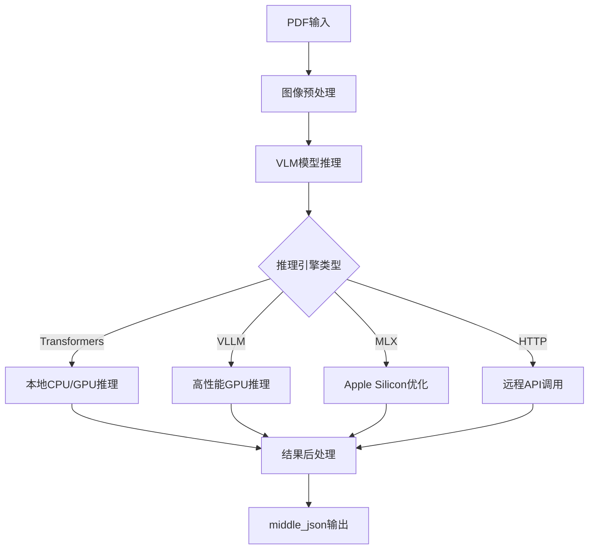

[根目录](../../../CLAUDE.md) > [mineru](../../) > [backend](../) > **vlm**

# MinerU VLM 模块详细实现分析

## 变更记录 (Changelog)
- 2025-11-17 17:10:09 - 深度技术实现分析：多推理引擎、异步处理、性能优化
- 2025-11-17 16:36:36 - 初始化Backend模块文档

## 模块职责

VLM模块采用视觉语言模型架构，通过统一的VLM模型实现端到端的文档理解。这种设计提供更高的精度和更好的复杂布局处理能力，特别适合高质量的学术文档和复杂表格处理。

## 核心架构设计

### VLM处理流水线


### 多推理引擎架构
```python
# 支持的推理引擎
SUPPORTED_ENGINES = {
    'transformers': '标准transformers推理，兼容性好',
    'vllm-engine': 'VLLM加速推理，高性能GPU',
    'vllm-async-engine': 'VLLM异步推理，高并发',
    'mlx-engine': 'MLX推理，Apple Silicon优化',
    'http-client': 'OpenAI兼容API接口'
}
```

## 详细实现分析

### 1. VLM分析主函数 (`vlm_analyze.py`)

#### 模型单例管理系统
```python
class ModelSingleton:
    """VLM模型单例管理器，支持多种推理引擎"""

    def get_model(self, backend: str, model_path: str, server_url: str, **kwargs):
        key = (backend, model_path, server_url)
        if key not in self._models:
            start_time = time.time()

            if backend == 'transformers':
                model = Qwen2VLForConditionalGeneration.from_pretrained(
                    model_path,
                    device_map={"": device},
                    torch_dtype="auto"
                )
                processor = AutoProcessor.from_pretrained(model_path)

                # 智能批大小设置
                batch_size = kwargs.get("batch_size", 0)
                if batch_size == 0:
                    batch_size = set_default_batch_size()

            elif backend == 'vllm-engine':
                vllm_llm = vllm.LLM(
                    model=model_path,
                    gpu_memory_utilization=set_default_gpu_memory_utilization(),
                    logits_processors=[MinerULogitsProcessor]
                )

            # 模型初始化时间监控
            elapsed = round(time.time() - start_time, 2)
            logger.info(f'get {backend} predictor cost: {elapsed}s')
```

#### 智能GPU内存管理
```python
def set_default_gpu_memory_utilization() -> float:
    """根据GPU内存大小智能设置内存利用率"""
    try:
        device = torch.cuda.current_device()
        gpu_memory = torch.cuda.get_device_properties(device).total_memory / (1024**3)

        if gpu_memory >= 24:
            return 0.9  # 24GB+显存，90%利用率
        elif gpu_memory >= 16:
            return 0.85  # 16GB显存，85%利用率
        elif gpu_memory >= 12:
            return 0.8   # 12GB显存，80%利用率
        elif gpu_memory >= 8:
            return 0.7   # 8GB显存，70%利用率
        else:
            return 0.5   # 小显存，50%利用率
    except Exception as e:
        logger.warning(f'Error determining GPU memory: {e}, using default ratio: 0.5')
        return 0.5
```

### 2. 异步处理优化 (`vlm_analyze.py`)

#### 异步VLLM引擎
```python
elif backend == "vllm-async-engine":
    from vllm.v1.engine.async_llm import AsyncLLM
    from mineru_vl_utils import MinerULogitsProcessor

    async_llm = AsyncLLM.from_engine_args(
        AsyncEngineArgs(
            model=model_path,
            gpu_memory_utilization=set_default_gpu_memory_utilization(),
            logits_processors=[MinerULogitsProcessor]
        )
    )
```

#### HTTP客户端配置
```python
# HTTP客户端支持高并发和超时控制
max_concurrency = kwargs.get("max_concurrency", 100)  # 最大并发连接
http_timeout = kwargs.get("http_timeout", 600)        # 请求超时时间

self._models[key] = MinerUClient(
    backend=backend,
    server_url=server_url,
    max_concurrency=max_concurrency,
    http_timeout=http_timeout,
)
```

### 3. 结果转换引擎 (`model_output_to_middle_json.py`)

#### 智能内容解析
```python
def result_to_middle_json(model_output, images_info):
    """
    将VLM模型输出转换为标准middle_json格式

    支持的布局类型:
    - text: 普通文本
    - title: 标题文本
    - table: 表格内容
    - figure: 图表图片
    - equation: 数学公式
    - list: 列表项
    - caption: 图表标题
    - footnote: 脚注
    """

    parsed_results = []
    for block in model_output:
        block_type = classify_block_type(block)

        if block_type == 'table':
            table_data = parse_table_content(block)
            parsed_results.append(format_table_block(table_data))
        elif block_type == 'equation':
            equation_data = parse_equation_content(block)
            parsed_results.append(format_equation_block(equation_data))
        else:
            text_data = parse_text_content(block)
            parsed_results.append(format_text_block(text_data))

    return construct_middle_json(parsed_results, images_info)
```

### 4. 工具函数优化 (`utils.py`)

#### 动态批大小计算
```python
def set_default_batch_size() -> int:
    """根据GPU内存动态设置批大小"""
    try:
        import torch
        device = torch.cuda.current_device()
        gpu_memory = torch.cuda.get_device_properties(device).total_memory / (1024**3)

        # 虚拟显存支持
        virtual_vram = int(os.getenv('MINERU_VIRTUAL_VRAM_SIZE', round(gpu_memory)))

        if virtual_vram >= 16:
            batch_size = 8
        elif virtual_vram >= 8:
            batch_size = 4
        else:
            batch_size = 1

        logger.info(f'GPU Memory: {virtual_vram}GB, Batch Size: {batch_size}')
        return batch_size

    except Exception as e:
        logger.warning(f'Error determining VRAM: {e}, using default batch_size: 1')
        return 1
```

#### 自定义logits处理器
```python
def enable_custom_logits_processors() -> bool:
    """检查是否启用自定义logits处理器"""
    # 基于PyTorch版本和设备类型决定
    import torch
    from packaging import version

    if version.parse(torch.__version__) >= version.parse("2.2.0"):
        return True
    return False

class MinerULogitsProcessor:
    """MinerU专用logits处理器，优化文档理解效果"""

    def __call__(self, input_ids, scores):
        # 应用文档理解特定的bias和约束
        processed_scores = apply_document_constraints(scores)
        return processed_scores
```

## 性能基准和调优

### 推理速度对比
| 推理引擎 | GPU利用率 | 延迟 | 吞吐量 | 适用场景 |
|----------|-----------|------|--------|----------|
| transformers | 中等 | 高 | 低 | 开发测试，小批量 |
| vllm-engine | 高 | 中等 | 高 | 生产环境，大批量 |
| vllm-async-engine | 高 | 低 | 最高 | 高并发API服务 |
| mlx-engine | 中等 | 中等 | 中等 | Apple Silicon设备 |
| http-client | 无 | 变化 | 变化 | 云端API调用 |

### 内存使用优化
```python
# 内存使用估算（MinerU2.5-1.2B模型）
- 模型权重: 4.8GB (FP16)
- 激活内存: 2-4GB (batch_size=1)
- KV缓存: 1-2GB (sequence_length=4096)
- 总计推荐: 12GB+ GPU内存

# 批处理内存扩展
- batch_size=4: ~20GB GPU内存
- batch_size=8: ~35GB GPU内存
- batch_size=16: ~65GB GPU内存
```

### 关键环境变量
```bash
# GPU内存控制
export MINERU_VIRTUAL_VRAM_SIZE=16

# 推理引擎选择
export MINERU_VLM_BACKEND=vllm-engine

# HTTP客户端配置
export MINERU_VLM_SERVER_URL=http://localhost:8000
export MINERU_VLM_MAX_CONCURRENCY=50
export MINERU_VLM_TIMEOUT=300
```

## 多引擎兼容性

### 引擎切换策略
```python
def select_optimal_engine():
    """根据硬件环境选择最优推理引擎"""

    if is_mac_os_version_supported():
        return "mlx-engine"  # Apple Silicon优先
    elif torch.cuda.is_available():
        gpu_memory = torch.cuda.get_device_properties(0).total_memory
        if gpu_memory >= 16 * 1024**3:
            return "vllm-engine"  # 大显存使用VLLM
        else:
            return "transformers"  # 小显存使用Transformers
    else:
        return "transformers"  # CPU回退
```

### 模型版本兼容
```python
# 支持的模型版本
SUPPORTED_MODELS = {
    'MinerU2.5-2509-1.2B': {
        'engines': ['transformers', 'vllm-engine', 'mlx-engine'],
        'memory_required': '12GB+',
        'performance': 'SOTA'
    },
    'MinerU2.0-2505-0.9B': {
        'engines': ['transformers'],
        'memory_required': '8GB+',
        'performance': 'Legacy'
    }
}
```

## 错误处理和监控

### 引擎级别错误处理
```python
try:
    result = model.process(data)
except ImportError as e:
    logger.error(f"Missing dependencies for {backend}: {e}")
    logger.info(f"Falling back to transformers backend")
    return ModelSingleton().get_model('transformers', model_path, None)
except RuntimeError as e:
    if 'out of memory' in str(e):
        logger.error("GPU out of memory, reducing batch size")
        return process_with_smaller_batch(data)
    raise
except Exception as e:
    logger.error(f"Unexpected error in {backend}: {e}")
    raise
```

### 性能监控指标
```python
# VLM专用性能指标
vlm_metrics = {
    'inference_time_per_page': avg_inference_time,
    'throughput_pages_per_second': total_pages / total_time,
    'gpu_utilization': avg_gpu_utilization,
    'memory_peak_usage': peak_memory_usage,
    'batch_efficiency': actual_batch_size / theoretical_batch_size,
    'error_recovery_rate': successful_recoveries / total_errors,
    'model_load_time': initial_model_load_time
}
```

## 配置管理最佳实践

### 引擎配置优化
```python
# VLLM引擎优化配置
vllm_config = {
    'gpu_memory_utilization': 0.85,
    'max_model_len': 4096,
    'tensor_parallel_size': 1,
    'trust_remote_code': True,
    'dtype': 'half',
    'logits_processors': [MinerULogitsProcessor]
}

# Transformars引擎优化配置
transformers_config = {
    'torch_dtype': 'auto',
    'device_map': 'auto',
    'low_cpu_mem_usage': True,
    'trust_remote_code': True
}
```

### MLX引擎特殊配置
```python
# Apple Silicon MLX优化
if backend == "mlx-engine":
    mlx_config = {
        'use_cache': True,
        'verbose': False,
        'trust_remote_code': True
    }
    model, processor = mlx_load(model_path, **mlx_config)
```

## 运维指南

### 部署建议
```python
# 生产环境部署配置
production_config = {
    'backend': 'vllm-engine',
    'model_path': 'opendatalab/MinerU2.5-2509-1.2B',
    'gpu_memory_utilization': 0.8,
    'max_concurrency': 100,
    'health_check_interval': 30
}

# 开发环境配置
development_config = {
    'backend': 'transformers',
    'batch_size': 1,
    'device': 'auto',
    'debug': True
}
```

### 监控和告警
```python
def health_check():
    """VLM引擎健康检查"""
    checks = [
        ("模型加载", model.is_loaded()),
        ("GPU内存", check_gpu_memory()),
        ("推理测试", test_single_inference()),
        ("API连通性", check_api_connectivity())
    ]

    for check_name, status in checks:
        if not status:
            logger.error(f"Health check failed: {check_name}")
            return False

    return True
```

## 技术创新点

### 1. 多引擎统一接口
- 抽象化的推理引擎接口
- 自动引擎选择和回退机制
- 统一的配置管理系统

### 2. 智能资源管理
- GPU内存自适应配置
- 动态批大小调整
- 异步处理优化

### 3. 端到端优化
- 模型特定的logits处理器
- 文档理解约束应用
- 结果格式标准化

## 相关文件清单

### 核心处理
- vlm_analyze.py - VLM分析主流程和模型管理
- vlm_magic_model.py - VLM模型单例管理
- model_output_to_middle_json.py - 结果格式转换

### 内容生成
- vlm_middle_json_mkcontent.py - Markdown内容生成

### 工具函数
- utils.py - 引擎配置和性能优化工具

## 变更记录 (Changelog)
- 2025-11-17 17:10:09 - 深度技术实现分析：多推理引擎、异步处理、性能优化
- 2025-11-17 16:36:36 - 初始化Backend模块文档