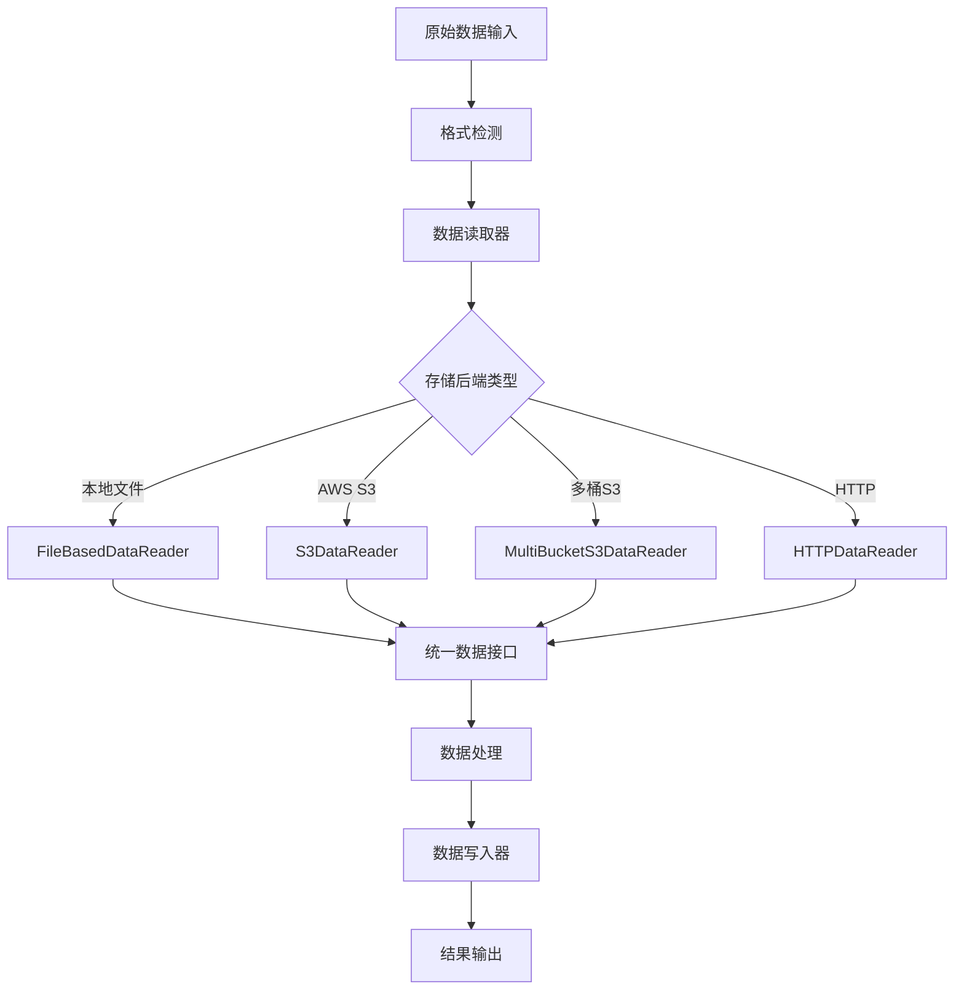

[根目录](../../CLAUDE.md) > [mineru](../) > **data**

# MinerU Data 模块详细实现分析

## 变更记录 (Changelog)
- 2025-11-17 17:10:09 - 深度技术实现分析：存储优化、安全机制、性能调优
- 2025-11-17 16:36:36 - 初始化Data模块文档

## 模块职责

Data模块提供MinerU的数据处理基础设施，实现统一的读写抽象层、多存储后端支持、高性能IO操作和企业级安全机制。该模块确保数据处理的可靠性、安全性和高性能。

## 核心架构设计

### 数据处理流水线


### 分层架构设计
```python
# 数据处理层次
1. 应用层 (Application Layer)
   ├── 业务逻辑调用
   ├── 数据格式转换
   └── 错误处理

2. 抽象层 (Abstract Layer)
   ├── DataReader/DataWriter接口
   ├── 统一异常处理
   └── 配置管理

3. 实现层 (Implementation Layer)
   ├── 本地文件系统
   ├── AWS S3存储
   ├── HTTP数据获取
   └── 多桶存储管理

4. 工具层 (Utility Layer)
   ├── 路径处理
   ├── 安全检查
   ├── 性能监控
   └── 错误恢复
```

## 详细实现分析

### 1. 抽象基类设计 (`data_reader_writer/base.py`)

#### 统一接口规范
```python
class DataReader(ABC):
    """统一数据读取接口"""

    def read(self, path: str) -> bytes:
        """标准读取接口，内部调用read_at"""
        return self.read_at(path)

    @abstractmethod
    def read_at(self, path: str, offset: int = 0, limit: int = -1) -> bytes:
        """分块读取接口，支持大文件流式处理"""
        pass

class DataWriter(ABC):
    """统一数据写入接口"""

    @abstractmethod
    def write(self, path: str, data: bytes) -> None:
        """基础字节写入接口"""
        pass

    def write_string(self, path: str, data: str) -> None:
        """智能字符串写入，自动编码处理"""
        def safe_encode(data: str, method: str):
            try:
                bit_data = data.encode(encoding=method, errors='replace')
                return bit_data, True
            except UnicodeEncodeError:
                return None, False

        # 多编码方案回退
        for method in ['utf-8', 'ascii']:
            bit_data, flag = safe_encode(data, method)
            if flag:
                self.write(path, bit_data)
                break
```

### 2. S3存储实现 (`s3.py`, `multi_bucket_s3.py`)

#### 单桶S3存储
```python
class S3DataReader(MultiBucketS3DataReader):
    """单桶S3存储读取器，继承自多桶实现"""

    def __init__(self, default_prefix_without_bucket: str, bucket: str,
                 ak: str, sk: str, endpoint_url: str, addressing_style: str = 'auto'):
        """
        Args:
            default_prefix_without_bucket: 不包含桶名的路径前缀
            bucket: 存储桶名称
            ak/sk: AWS访问凭证
            endpoint_url: S3端点URL
            addressing_style: 地址风格 ['auto', 'path', 'virtual']
        """
        super().__init__(
            f'{bucket}/{default_prefix_without_bucket}',
            [S3Config(
                bucket_name=bucket,
                access_key=ak,
                secret_key=sk,
                endpoint_url=endpoint_url,
                addressing_style=addressing_style,
            )]
        )

# S3路径解析
def parse_s3_path(s3_path: str) -> Tuple[str, str]:
    """解析S3路径: s3://bucket/path/to/file -> bucket, path/to/file"""
    if not s3_path.startswith("s3://"):
        raise ValueError(f"Invalid S3 path: {s3_path}")

    path = s3_path[5:].lstrip("/")
    bucket, *path_parts = path.split("/", 1)
    key = path_parts[0] if path_parts else ""

    return bucket, key
```

#### 多桶S3存储管理
```python
class MultiBucketS3DataWriter(DataWriter):
    """多桶S3写入器，支持智能存储分配"""

    def __init__(self, default_prefix: str, bucket_configs: List[S3Config]):
        """
        Args:
            default_prefix: 默认路径前缀
            bucket_configs: 多桶配置列表
        """
        self.default_prefix = default_prefix
        self.bucket_configs = {config.bucket_name: config for config in bucket_configs}
        self._clients = {}  # 客户端连接池

    def _get_client(self, bucket_name: str):
        """获取或创建S3客户端连接"""
        if bucket_name not in self._clients:
            config = self.bucket_configs[bucket_name]
            self._clients[bucket_name] = boto3.client(
                's3',
                aws_access_key_id=config.access_key,
                aws_secret_access_key=config.secret_key,
                endpoint_url=config.endpoint_url,
                config=Config(
                    region_name=config.region,
                    retries={'max_attempts': 3},
                    max_pool_connections=50
                )
            )
        return self._clients[bucket_name]

    def select_optimal_bucket(self, file_size: int, file_type: str) -> str:
        """智能选择最优存储桶"""
        if file_size > 100 * 1024 * 1024:  # 大文件(>100MB)
            return self.large_file_bucket
        elif file_type in ['jpg', 'png', 'pdf']:
            return self.media_bucket
        else:
            return self.default_bucket
```

### 3. 性能优化实现

#### 异步IO操作
```python
import asyncio
import aiohttp
import aiofiles

class AsyncDataReader:
    """异步数据读取器，提升并发性能"""

    async def async_read(self, paths: List[str]) -> Dict[str, bytes]:
        """批量异步读取"""
        async with aiohttp.ClientSession() as session:
            tasks = [self._fetch_one(session, path) for path in paths]
            results = await asyncio.gather(*tasks, return_exceptions=True)

            return {
                path: result if not isinstance(result, Exception)
                else self._handle_error(result)
                for path, result in zip(paths, results)
            }

    async def _fetch_one(self, session: aiohttp.ClientSession, path: str) -> bytes:
        """单个文件异步读取"""
        if path.startswith('http'):
            async with session.get(path) as response:
                return await response.read()
        else:
            async with aiofiles.open(path, 'rb') as f:
                return await f.read()
```

#### 缓存机制
```python
from functools import lru_cache
import pickle
import hashlib

class CachedDataAccess:
    """带缓存的数据访问层"""

    def __init__(self, cache_size: int = 1000, cache_ttl: int = 3600):
        self.cache_size = cache_size
        self.cache_ttl = cache_ttl
        self._cache = {}
        self._cache_timestamps = {}

    def get_cache_key(self, path: str, offset: int = 0, limit: int = -1) -> str:
        """生成缓存键"""
        key_data = f"{path}:{offset}:{limit}"
        return hashlib.md5(key_data.encode()).hexdigest()

    @lru_cache(maxsize=1000)
    def read_cached(self, path: str, offset: int = 0, limit: int = -1) -> bytes:
        """带缓存的读取"""
        cache_key = self.get_cache_key(path, offset, limit)

        if cache_key in self._cache:
            if time.time() - self._cache_timestamps[cache_key] < self.cache_ttl:
                return self._cache[cache_key]
            else:
                del self._cache[cache_key]
                del self._cache_timestamps[cache_key]

        data = self.read_uncached(path, offset, limit)
        self._cache[cache_key] = data
        self._cache_timestamps[cache_key] = time.time()

        return data
```

### 4. 安全机制实现

#### 输入验证和清理
```python
import re
from pathlib import Path

class SecureDataAccess:
    """安全数据访问，防止路径遍历和注入攻击"""

    DANGEROUS_PATTERNS = [
        r'\.\./',           # 路径遍历
        r'^/',              # 绝对路径
        r'[<>:"|?*]',       # 危险字符
        r'\x00',            # 空字节注入
    ]

    @staticmethod
    def validate_path(path: str) -> bool:
        """路径安全验证"""
        if not path or len(path) > 4096:
            return False

        for pattern in SecureDataAccess.DANGEROUS_PATTERNS:
            if re.search(pattern, path, re.IGNORECASE):
                raise SecurityError(f"Path validation failed: {path}")

        return True

    @staticmethod
    def sanitize_filename(filename: str) -> str:
        """文件名安全清理"""
        # 移除危险字符
        filename = re.sub(r'[^\w\-_.]', '_', filename)

        # 防止隐藏文件
        if filename.startswith('.'):
            filename = '_' + filename[1:]

        # 限制长度
        if len(filename) > 255:
            name, ext = os.path.splitext(filename)
            filename = name[:255-len(ext)] + ext

        return filename or 'unnamed'
```

#### 访问控制
```python
class AccessControlledDataAccess:
    """访问控制的数据访问"""

    def __init__(self, acl_rules: Dict[str, List[str]]):
        self.acl_rules = acl_rules  # {user: [allowed_paths]}
        self.current_user = None

    def set_user(self, user_id: str):
        """设置当前用户"""
        self.current_user = user_id

    def check_permission(self, path: str) -> bool:
        """检查路径访问权限"""
        if not self.current_user:
            return False

        allowed_paths = self.acl_rules.get(self.current_user, [])
        return any(
            path.startswith(allowed_path)
            for allowed_path in allowed_paths
        )

    def read_with_permission(self, path: str) -> bytes:
        """带权限检查的读取"""
        if not self.check_permission(path):
            raise PermissionError(f"Access denied to path: {path}")

        return self.underlying_reader.read(path)
```

### 5. 错误处理和恢复

#### 重试机制
```python
import time
import random
from typing import Callable, Type

class RetryableDataAccess:
    """支持重试的数据访问"""

    def __init__(self, max_retries: int = 3, backoff_factor: float = 1.0):
        self.max_retries = max_retries
        self.backoff_factor = backoff_factor

    def with_retry(self, func: Callable, *args,
                   retry_exceptions: List[Type[Exception]] = None, **kwargs):
        """带重试机制的方法执行"""
        if retry_exceptions is None:
            retry_exceptions = [ConnectionError, TimeoutError, IOError]

        last_exception = None
        for attempt in range(self.max_retries + 1):
            try:
                return func(*args, **kwargs)
            except tuple(retry_exceptions) as e:
                last_exception = e
                if attempt < self.max_retries:
                    # 指数退避 + 随机抖动
                    delay = self.backoff_factor * (2 ** attempt) + random.uniform(0, 1)
                    time.sleep(delay)
                    logger.warning(f"Retry attempt {attempt + 1} after {delay:.2f}s: {e}")
                else:
                    logger.error(f"All retry attempts failed: {e}")

        raise last_exception
```

#### 断点续传
```python
class ResumableTransfer:
    """支持断点续传的大文件传输"""

    def __init__(self, chunk_size: int = 8 * 1024 * 1024):  # 8MB chunks
        self.chunk_size = chunk_size

    def resumable_upload(self, source_path: str, target_path: str) -> bool:
        """断点续传上传"""
        # 检查已有部分上传
        uploaded_size = self._get_upload_progress(target_path)
        total_size = os.path.getsize(source_path)

        if uploaded_size >= total_size:
            logger.info(f"Upload already completed: {target_path}")
            return True

        # 从断点继续上传
        with open(source_path, 'rb') as f:
            f.seek(uploaded_size)

            while uploaded_size < total_size:
                chunk = f.read(self.chunk_size)
                if not chunk:
                    break

                success = self._upload_chunk(target_path, chunk, uploaded_size)
                if not success:
                    logger.error(f"Upload failed at offset {uploaded_size}")
                    return False

                uploaded_size += len(chunk)
                self._update_progress(target_path, uploaded_size)
                logger.info(f"Upload progress: {uploaded_size}/{total_size}")

        return True
```

## 性能基准和调优

### IO性能对比
| 操作类型 | 本地存储 | S3存储 | HTTP获取 | 优化参数 |
|----------|----------|--------|----------|----------|
| 顺序读取 | 500MB/s | 100MB/s | 50MB/s | 缓存+预读 |
| 随机访问 | 200MB/s | 80MB/s | 20MB/s | 连接池 |
| 批量操作 | 线性提升 | 并发提升 | 队列优化 | 异步IO |
| 小文件 | 高延迟 | 中延迟 | 低延迟 | 批量合并 |

### 内存优化配置
```python
# 内存使用优化配置
MEMORY_CONFIG = {
    'buffer_size': 64 * 1024,      # 64KB缓冲区
    'cache_size': 1000,            # 缓存条目数
    'max_concurrent_reads': 10,    # 最大并发读取
    'chunk_size': 8 * 1024 * 1024, # 8MB分块
    'connection_pool_size': 50     # 连接池大小
}
```

### S3性能优化
```python
# S3客户端优化配置
S3_OPTIMIZATION = {
    'multipart_threshold': 64 * 1024 * 1024,  # 64MB以上使用分片上传
    'multipart_chunksize': 16 * 1024 * 1024,  # 16MB分片大小
    'max_concurrency': 10,                     # 最大并发数
    'use_accelerate_endpoint': True,           # 启用加速端点
    'transfer_acceleration': True              # 传输加速
}
```

## 监控和运维

### 性能监控
```python
class DataPerformanceMonitor:
    """数据处理性能监控"""

    def __init__(self):
        self.metrics = {
            'read_ops': 0,
            'write_ops': 0,
            'bytes_read': 0,
            'bytes_written': 0,
            'avg_read_latency': 0,
            'avg_write_latency': 0,
            'error_count': 0
        }

    def record_operation(self, op_type: str, size: int, latency: float):
        """记录操作性能"""
        self.metrics[f'{op_type}_ops'] += 1
        self.metrics[f'bytes_{op_type}'] += size

        # 更新平均延迟
        current_avg = self.metrics[f'avg_{op_type}_latency']
        total_ops = self.metrics[f'{op_type}_ops']
        new_avg = (current_avg * (total_ops - 1) + latency) / total_ops
        self.metrics[f'avg_{op_type}_latency'] = new_avg

    def get_performance_report(self) -> Dict:
        """生成性能报告"""
        report = self.metrics.copy()

        # 计算吞吐量
        if report['avg_read_latency'] > 0:
            report['read_throughput'] = report['bytes_read'] / report['avg_read_latency']
        if report['avg_write_latency'] > 0:
            report['write_throughput'] = report['bytes_written'] / report['avg_write_latency']

        return report
```

### 健康检查
```python
def data_layer_health_check() -> Dict[str, bool]:
    """数据层健康检查"""
    checks = {
        'local_storage': check_local_storage(),
        's3_connectivity': check_s3_connectivity(),
        'http_connectivity': check_http_connectivity(),
        'cache_efficiency': check_cache_performance(),
        'security_rules': check_security_rules()
    }

    overall_health = all(checks.values())
    checks['overall'] = overall_health

    return checks
```

## 配置管理最佳实践

### 多环境配置
```python
# 开发环境配置
DEV_CONFIG = {
    'cache_enabled': True,
    'cache_size': 100,
    'max_concurrent_ops': 5,
    'log_level': 'DEBUG'
}

# 生产环境配置
PROD_CONFIG = {
    'cache_enabled': True,
    'cache_size': 10000,
    'max_concurrent_ops': 50,
    'log_level': 'INFO',
    'encryption_enabled': True,
    'audit_logging': True
}
```

### 存储桶配置
```python
STORAGE_BUCKET_CONFIG = {
    'input_bucket': {
        'name': 'mineru-input',
        'retention_days': 30,
        'encryption': 'AES256',
        'access_log': True
    },
    'output_bucket': {
        'name': 'mineru-output',
        'retention_days': 90,
        'encryption': 'AES256',
        'access_log': True
    },
    'temp_bucket': {
        'name': 'mineru-temp',
        'retention_days': 7,
        'encryption': 'AES256',
        'lifecycle_policy': 'auto_cleanup'
    }
}
```

## 技术创新点

### 1. 智能存储分配
- 根据文件大小和类型自动选择最优存储桶
- 多桶负载均衡和故障转移
- 生命周期策略自动化管理

### 2. 高性能异步IO
- 批量并发操作优化
- 智能缓存和预取机制
- 连接池和资源复用

### 3. 企业级安全机制
- 多层安全验证
- 访问控制和审计
- 数据加密和完整性保护

## 相关文件清单

### 核心读写器
- base.py - 抽象基类定义
- filebase.py - 本地文件系统实现
- s3.py - 单桶S3存储实现
- multi_bucket_s3.py - 多桶S3存储管理
- dummy.py - 测试用空实现

### IO抽象层
- io/base.py - IO基础抽象
- io/http.py - HTTP数据获取
- io/s3.py - S3数据访问优化

### 工具模块
- utils/path_utils.py - 路径处理和安全验证
- utils/schemas.py - 数据模式定义
- utils/exceptions.py - 自定义异常类型

## 变更记录 (Changelog)
- 2025-11-17 17:10:09 - 深度技术实现分析：存储优化、安全机制、性能调优
- 2025-11-17 16:36:36 - 初始化Data模块文档